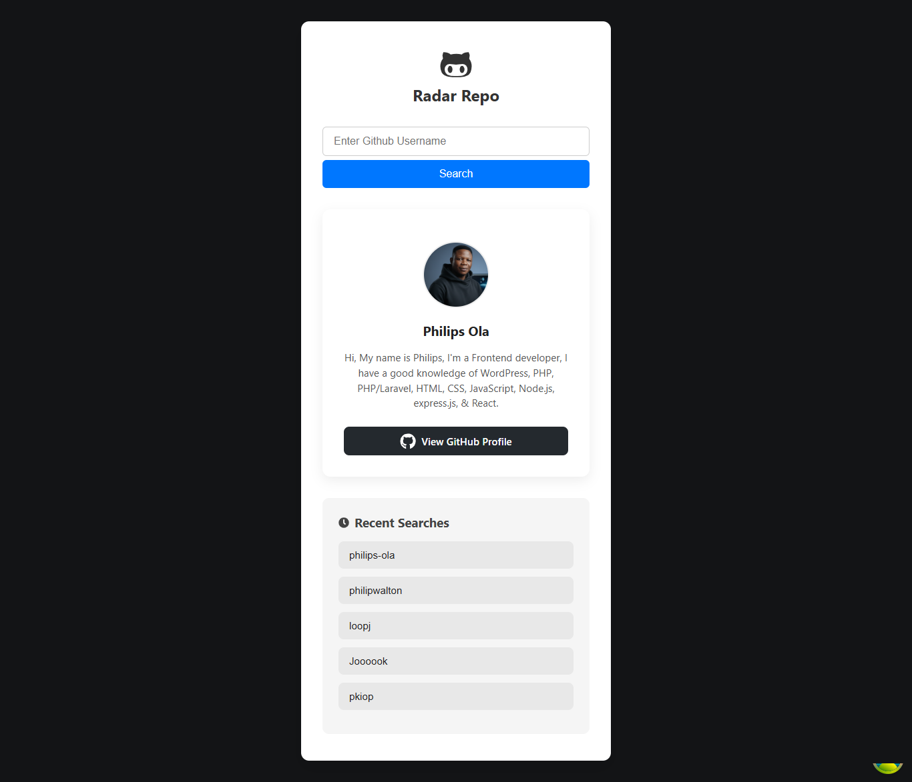

# Repo Radar

Repo Radar is a GitHub repository discovery and analysis dashboard that helps developers, researchers, students, and teams explore software projects quickly and confidently. It turns public GitHub repository data into a clean, visual intelligence layer for repository discovery and comparison.

The live project is deployed at:

https://repo-radar-ola.vercel.app/


## Why Repo Radar?

GitHub is the largest public software registry, but searching and evaluating repositories can quickly become overwhelming. Repo Radar simplifies that process by displaying repository search results, metadata, quality indicators, project context, and activity signals in one place.

The goal is to make open-source repository exploration:

- Faster
- More informative
- More visual
- More decision-friendly

## Project Overview

Repo Radar is designed to help users answer questions such as:

- Which repositories are active and popular?
- What programming languages are most represented in a discovery path?
- Which repositories have strong community signals?
- Which repository is most relevant for a given use case?

The app organizes this information into a polished dashboard experience with repository cards, metadata summaries, and important GitHub signals.

## Features

Repo Radar includes several key features:

- GitHub repository search and discovery
- Repository cards with project metadata
- Metrics for stars, forks, watchers, issues, and activity
- Language and topic awareness
- Repository ranking and relevance indicators
- Visual dashboard styling for an intuitive user experience
- Responsive layout that works across desktop and smaller screens
- Clean UI for scanning and comparing repositories

## Screenshots

The screenshots are available in:

```text
public/screenshots
```


These screenshots can be used to demonstrate major UI screens such as:

- Search and repository listing
- Repository detail cards
- Dashboard sections
- Responsive UI states

## Tech Stack

Repo Radar is a frontend project built around modern web development and GitHub data workflows.

Common stack choices for this type of project include:

- Next.js
- React
- TypeScript
- Tailwind CSS
- GitHub API integration
- Vercel deployment

## Project Structure

```text
Repo-Radar/
├── public/
│   └── screenshots/         # UI screenshots
├── src/
│   ├── app/                 # App routes and page layouts
│   ├── components/          # Reusable UI components
│   ├── lib/                 # Helpers, API integration, utilities
│   └── styles/              # CSS and theme styles
├── package.json
└── README.md
```

## Local Setup

### Prerequisites

Make sure you have the following installed:

- Node.js 18+
- npm or pnpm
- A GitHub API token if your app needs GitHub authentication or higher API limits

### Install Dependencies

Clone the repository:

```bash
git clone https://github.com/your-username/Repo-Radar.git
cd Repo-Radar
```

Install dependencies:

```bash
npm install
```

### Run Locally

Start the development server:

```bash
npm run dev
```

The app should be available at:

```text
http://localhost:3000
```

## Production Build

Create a production build:

```bash
npm run build
```

Serve the production build locally:

```bash
npm run start
```

## Environment Variables

If the project uses GitHub API requests, you may need a GitHub token or a custom API base URL. Add environment variables locally using `.env.local`:

```env
GITHUB_TOKEN=your_github_token
NEXT_PUBLIC_GITHUB_API_URL=https://api.github.com
```

For Vercel deployment, add the same environment variables in the Vercel project settings.

## Data Sources

Repo Radar relies on GitHub metadata such as:

- Repository name and description
- Owner information
- Stars, forks, issues, and watchers
- License and programming language
- Topics and labels
- Repository activity and update timestamps

## User Experience

The UI is designed to help users explore repositories without needing to read every raw GitHub page. Users can scan repository stats, project context, language coverage, and repository metadata quickly through the app’s dashboard-like experience.

## Roadmap

Future improvements may include:

- Better repository comparisons
- User-authored favorite repository lists
- Personalized recommendation features
- Trending repository views by time period
- Additional charts for repository activity
- Improved search relevance and filtering
- Better rate-limit handling and API caching
- Contributions and commit activity insights

## Contributing

Contributions are welcome. To contribute:

1. Fork the repository.
2. Create a local feature branch.
3. Make your changes.
4. Run relevant linting or tests.
5. Submit a pull request with a clear description.

## License

This project is distributed under the MIT license unless otherwise noted.

## Contact

For questions, issues, or collaboration requests, please use the repository issues or project discussion page.

## Summary

Repo Radar is a repository intelligence interface for open-source discovery. It helps developers look beyond repository names and descriptions by showing useful repository signals and metadata in a modern, friendly, and readable form. The live project is available at:

https://repo-radar-ola.vercel.app/